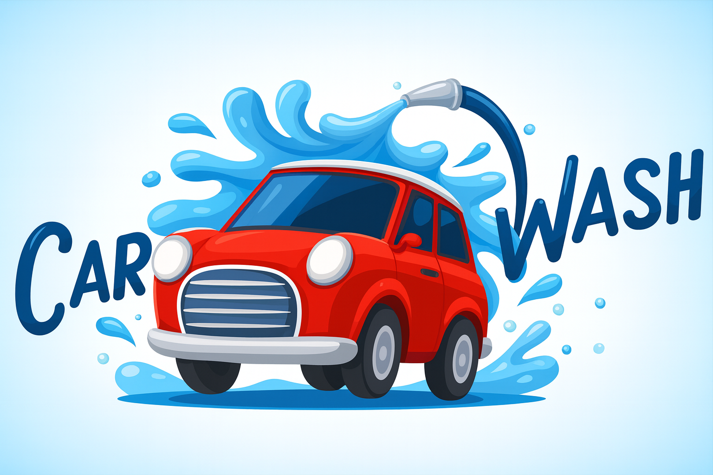

# 🧼 Sistema de Gestión de Lavadero

**Instituto:** IDRA – Tecnicatura en Desarrollo de Software  
**Materia:** Desarrollo de Sistemas Orientado a Objetos  
**Profesor:** Esteban Santini  
**Integrantes:** Iñaki Velo, Emmanuel Espinosa, Lorenzo Colombo  
**Año:** 2025  

---

## 🧩 1. Introducción

El presente documento detalla el desarrollo del **Sistema de Gestión de Lavadero**, un proyecto realizado como **Trabajo Práctico Integrador** para la materia *Desarrollo de Sistemas Orientado a Objetos*.  
Este trabajo busca aplicar de forma práctica los conceptos fundamentales de la **Programación Orientada a Objetos (POO)** y las **arquitecturas de software** vistas durante el curso.

El sistema tiene como finalidad **optimizar la administración de un lavadero de autos**, permitiendo gestionar de manera sencilla **clientes, autos y reservas de turnos**.  
Gracias a la implementación de los patrones **MVC** y **DAO**, se logró una estructura clara, modular y escalable, separando correctamente las responsabilidades entre la lógica del negocio, la interfaz de usuario y la capa de datos.

El proyecto fue desarrollado en **Java**, utilizando **Swing** para la creación de la interfaz gráfica y **MySQL** como motor de base de datos.  
El uso de **JDBC** permitió una comunicación eficiente con la base, garantizando persistencia y buen rendimiento general del sistema.

---

## 🧱 2. Arquitectura del sistema

El sistema se diseñó siguiendo la arquitectura **Modelo - Vista - Controlador (MVC)** junto con el patrón **DAO** para la persistencia.  
Esta combinación permitió separar claramente cada parte del proyecto:

### 🧠 Modelo
Contiene las clases principales:  
`Cliente`, `Auto`, `Reserva`.  
Representan las entidades del dominio e incluyen atributos, constructores, métodos de acceso y validaciones básicas.

### 💻 Vista
Compuesta por interfaces gráficas en **Java Swing**, donde el usuario puede realizar operaciones de **alta, baja, modificación y consulta**.  
La vista está pensada para ser **simple, intuitiva y accesible**.

### ⚙️ Controlador
Procesa las solicitudes del usuario, valida los datos y se comunica con la capa DAO para realizar las operaciones correspondientes.

### 🗄️ DAO (Data Access Object)
Maneja el acceso a la base de datos mediante **JDBC**.  
Cada entidad tiene su propio DAO que implementa las operaciones **CRUD** (Create, Read, Update, Delete).

> Este esquema permite que, si en el futuro se cambia la base de datos o la interfaz, el resto del sistema se mantenga sin modificaciones profundas.

---

## 🚗 3. Entidades principales

El sistema gestiona tres entidades relacionadas entre sí:

### 👤 Cliente
Guarda los datos personales del cliente: nombre, apellido, DNI y teléfono.  
El **DNI** se usa como identificador único para evitar duplicados.

### 🚘 Auto
Contiene información sobre el vehículo: patente, tipo e ID del cliente.  
Cada auto está asociado a un cliente (uno a muchos).

### 📅 Reserva
Representa el turno de lavado.  
Relaciona un cliente con su vehículo e incluye tipo de lavado, fecha, horario y precio.  
Se validan datos para evitar **fechas pasadas** o **campos incompletos**.

Cada entidad tiene su propio **Controlador** y **DAO**, manteniendo una estructura limpia y reutilizable.

---

## 🗃️ 4. Base de datos

Para la persistencia de los datos se utilizó una base de datos **MySQL** llamada `reservas_lavadero`, compuesta por tres tablas relacionadas:

| Tabla | Campos |
|--------|---------|
| **CLIENTES** | id_cliente, nombre, apellido, dni, teléfono |
| **AUTOS** | id_auto, patente, tipo, id_cliente |
| **RESERVAS** | id_reserva, id_cliente, id_auto, turno, tipo_lavado, precio |

Estas tablas están unidas mediante **claves foráneas**, asegurando la **integridad referencial**.  
Las relaciones permiten identificar rápidamente qué autos pertenecen a un cliente y qué reservas tiene cada vehículo.

---

## ⚠️ 5. Manejo de excepciones

El manejo de errores y excepciones fue clave en el desarrollo.  
Se implementaron bloques `try-catch` en todas las operaciones críticas, especialmente en las clases **DAO**, donde pueden surgir errores de conexión o consultas SQL.

### 🔍 Validaciones implementadas
- Evitar campos vacíos o con formato incorrecto.  
- Prevenir **DNI o patentes duplicadas**.  
- Bloquear **reservas con fechas pasadas o inválidas**.

Gracias a estas validaciones, el sistema mantiene su **estabilidad** y evita datos inconsistentes en la base.

---

## 📋 6. Casos de uso y diagrama de secuencia

### Casos de uso principales
El sistema está pensado para un **empleado del lavadero**, quien puede realizar las siguientes acciones desde la interfaz gráfica:

#### 👤 Gestionar clientes
Registrar nuevos clientes, editar datos o eliminarlos.

#### 🚘 Gestionar autos
Asociar vehículos a clientes, modificar información o darlos de baja.

#### 🧾 Registrar reservas
Crear nuevas reservas indicando turno, tipo de lavado y precio.

#### 🔍 Consultar reservas
Visualizar reservas, filtrarlas por fecha o cliente, y cancelarlas si corresponde.

Cada acción se implementa mediante formularios específicos, permitiendo al usuario trabajar sin acceder directamente a la base.

---

### 🔄 Diagrama de secuencia – Registrar Reserva

1. El empleado ingresa los datos de la reserva (DNI, patente, tipo de lavado, fecha y hora).  
2. La **Vista** envía la información al `ReservaController`.  
3. El **Controlador** valida los datos (cliente y auto existentes, fecha válida, turno libre).  
4. Si todo es correcto, el **DAO** inserta los datos en la base con una sentencia SQL.  
5. El DAO devuelve el resultado y la interfaz muestra un mensaje confirmando la reserva.

> Este flujo garantiza retroalimentación inmediata y coherencia de datos en todo momento.

---

## 🧠 7. Conclusión

El **Sistema de Gestión de Lavadero** permitió aplicar conocimientos de **POO**, **MVC**, **DAO**, manejo de excepciones y conexión con bases de datos.  
La experiencia de desarrollar un sistema completo ayudó a comprender cómo organizar un proyecto real con una clara separación de capas.

El resultado es un programa **estable, funcional y escalable**, capaz de gestionar eficientemente los datos de un lavadero.

### 🔮 Posibles mejoras futuras
- Reportes automáticos de clientes o reservas.  
- Generación de comprobantes.  
- Niveles de usuario según permisos.

